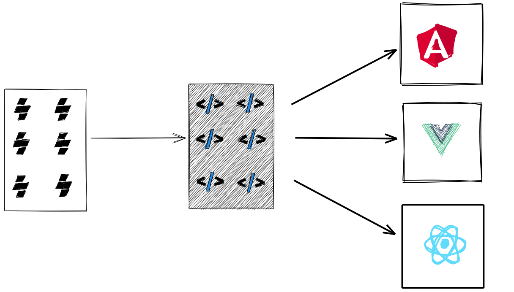

# Web components integration into Angular, React and Vue applications
> A repository to show case that same component library can be used in angular, react and vue applications

The library used in these applications is generated from: https://github.com/Madhusuthanan-B/Stencil-Component-Library

## Pre-Requisite
* Install yalc globally `npm i yalc -g` as we are not publishing the library used in these applciations to npm registry
* Clone this repository: https://github.com/Madhusuthanan-B/Stencil-Component-Library and publish the package using yalc
* Once the package is published, then the published package can be added into the applications of this repo using `yalc add @foo/core-library`

## Steps to launch the application

* Install yalc globally `npm i yalc -g`
* From root level, do `npm install`
* cd angular-app and do `npm install` and `npm run add-lib`
* cd react-app and do `npm install` and `npm run add-lib`
* cd vue-app and do `npm install` and `npm run add-lib`
* From root level, `npm run start` - This will concurrently start angular, react and vue apps on different ports

## Applications will be launched on the below urls

| Application | Url                   |
|-------------|-----------------------|
| Angular     | http://localhost:4200 |
| React       | http://localhost:3000 |
| Vue         | http://localhost:8080 |

## Tooling

* This repository comes with VS Code extension (Not published in store. Available for demo purpose).
* This extension will provide you with the available web component snippets to increase your productivity.
* The idea is to provide a good developer experience and keep the documentation very close (near your fingertips) while coding.
* To make use of this, download the .vsix file under tooling directory
* Install this in your VS Code: https://stackoverflow.com/questions/42017617/how-to-install-vs-code-extension-manually
